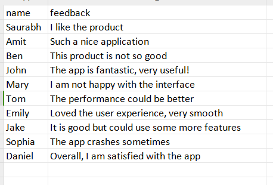
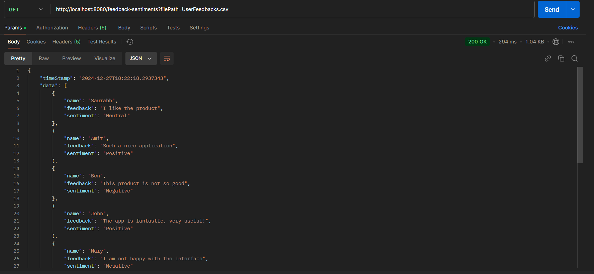

# `User Feedback Sentiment Analysis API`

### Step 1: Create a CSV file. Here's the sample:



### Step 2: Set up your sentiment analysis API
1. **Run the Server**: Make sure your application that processes feedback sentiment is running locally on `http://localhost:8080`.

2. **Use Postman or Browser**: Open Postman or any HTTP client tool (like a browser).

3. **Hit the API Endpoint**: Make a GET request to the following URL:

   ```
   http://localhost:8080/feedback-sentiments?filePath=UserFeedbacks.csv
   ```

4. **JSON Response**: Once the API processes the CSV file and performs sentiment analysis, you will receive a JSON response containing the sentiment for each user feedback. For example, the JSON might look like this:
  - 
